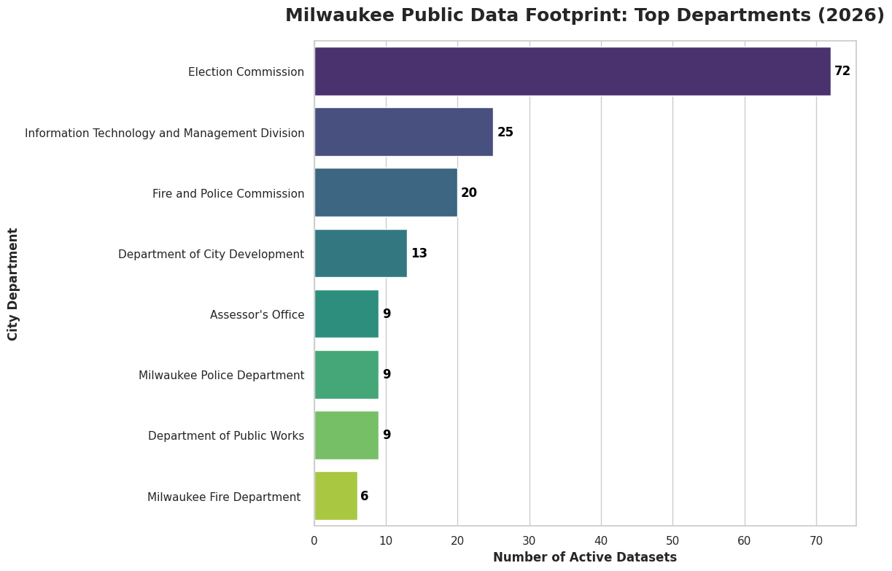

# Milwaukee Open Data Analysis: City Dataset Distribution (2026)

## 📌 Project Overview
I built this project to explore the digital transparency of the City of Milwaukee. This automated pipeline identifies which city departments are leading the way in open data availability.

## 📊 Key Insights
* **Top Contributors:** The analysis reveals that the **Election Commission** currently maintains the largest volume of public records.
* **Technical Milestone:** Successfully migrated from basic Matplotlib charts to Seaborn for boardroom-ready visualizations.

## 🛠️ Tools & Technologies
* **Python:** Core logic and automation.
* **Pandas:** Data ingestion and transformation.
* **Seaborn & Matplotlib:** Advanced data visualization.
* **Google Colab:** Cloud-based development environment.

## 🚀 How to Run This Project
1. Click the **"Open in Colab"** button at the top of the notebook.
2. Run all cells to fetch the **live** 2026 catalog directly from the Milwaukee Data Portal.
